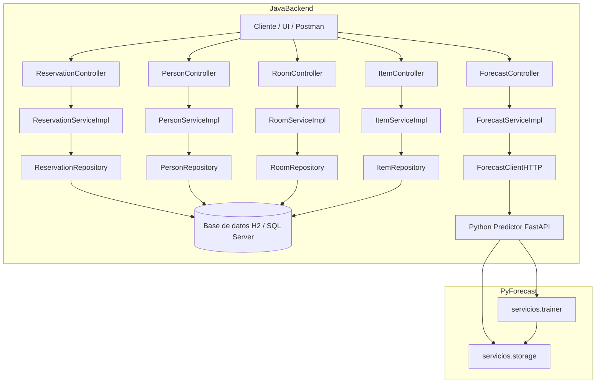

## Diagrama de arquitectura

Diagrama Mermaid que muestra la interacción entre el backend Java y el servicio Python.

Nota: si no ves el render en VS Code, instala la extensión "Mermaid Preview" o renombra el archivo a `.md` y utiliza un preview de Markdown con soporte para Mermaid.
